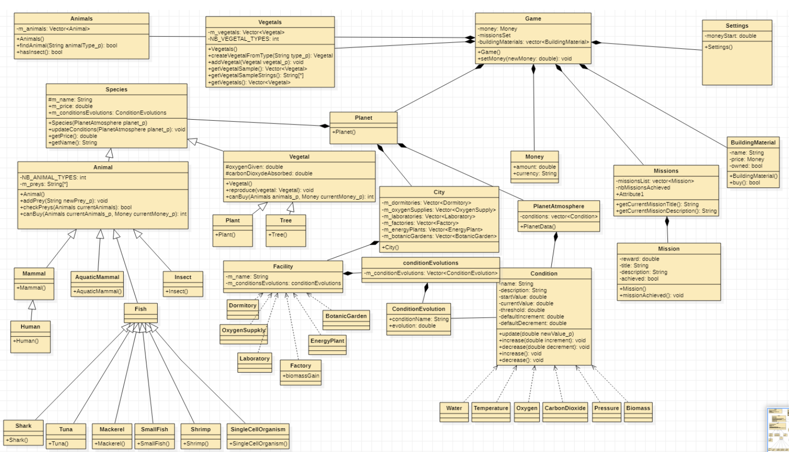
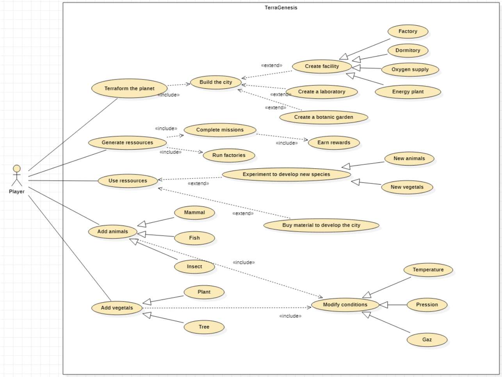

# UTBM AP4B Project #
## Project informations ##
Project team :
* Daniele Wandji
* Zackaria Bounnit
* Hugo Audran
* Valentin Mercy

Langage: Java

Description :
UTBM AP4B Project aims to develop a new version of TerraGenesis game in object-oriented java

## Gameplay ##
You can find a gameplay video on YouTube : [click here](https://youtu.be/VOdAWnPiQBk)

## UML Diagrams ##
### Classes ###

Generated with StarUML : see [Classes_UML](UML/Classes_UML.xmi)

### Use cases ###

Generated with StarUML : see [Classes_UML](UML/Use%20Case%20Diagram.mdj)